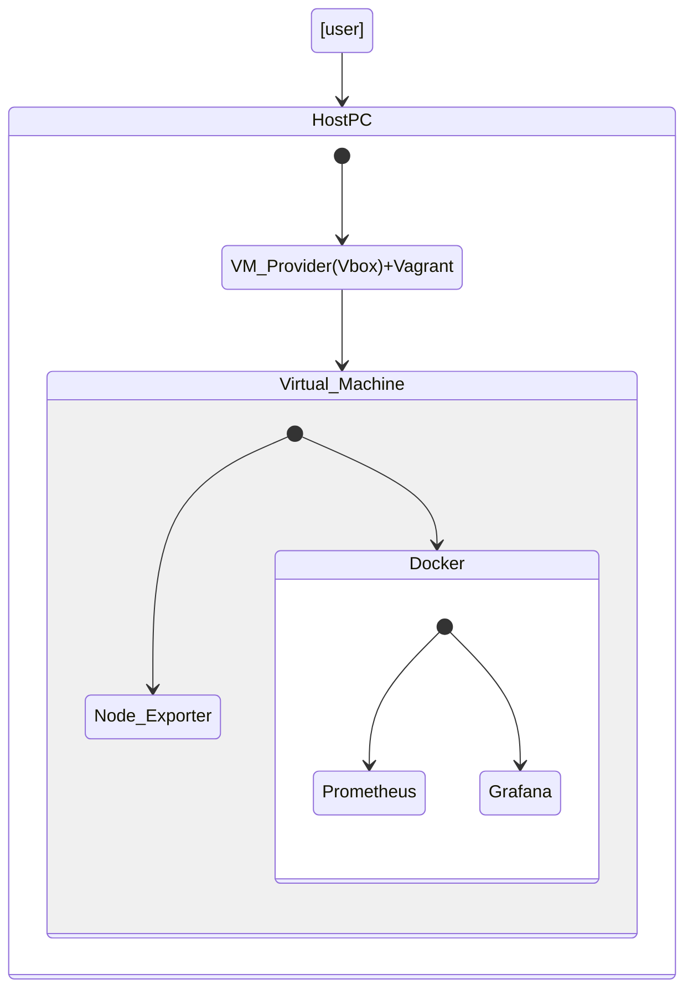
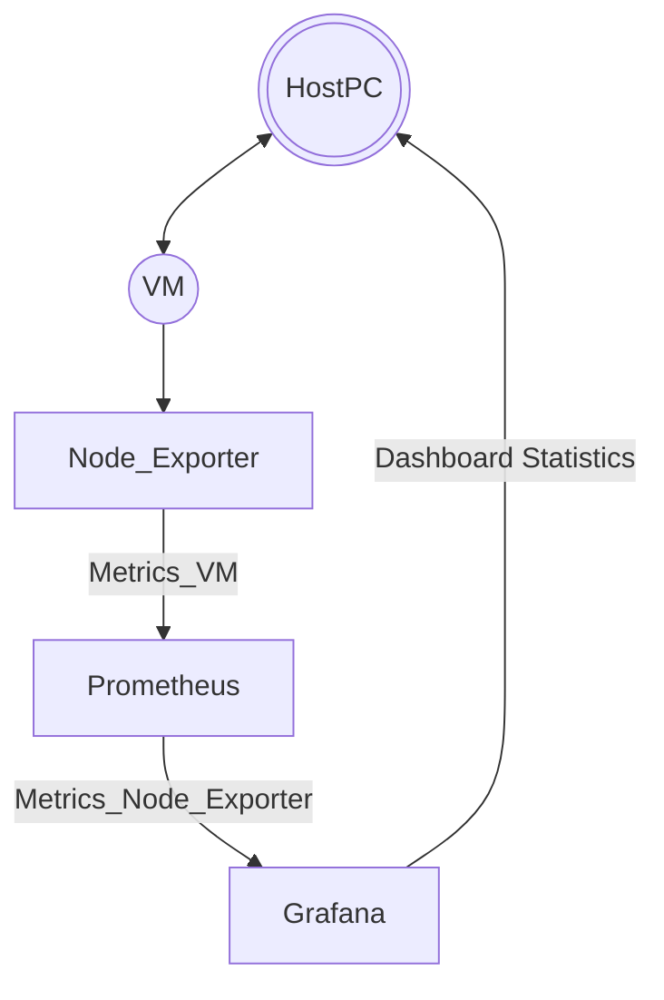

# test-vagrant-ansible-docker-grafana_host

## Задача: Тестирование автоматического сценария с помощью Vagrant

Необходимо написать Vagrantfile который по команде vagrant up сделает следующее:
1) Запустит бокс Ubuntu 20.04 (https://app.vagrantup.com/generic/)
2) Внутри ВМ произойдет автоматическая установка docker и docker compose (используя ansible).
3) Внутри ВМ произойдет установка node exporter для Prometheus (используя ansible).
4) С помощью docker compose (docker-compose up, сам docker compose стоит дернуть так же через ansible) будет запущено 2 контейнера:
    
    4.1) Первый контейнер с prometheus, который будет настроен на сбор метрик с node exporter из Ubuntu

    4.2) Второй контейнер с grafana, которая будет предварительно преднастроена: в качестве datasource используется prometheus из соседнего контейнера, уже загружен dashboard 1860 (https://grafana.com/grafana/dashboards/1860), который визуализирует метрики полученные с node exporter

5) Контейнер с grafana должен экспозить 3000 порт контейнера в ВМ с убунту

6) Сама ВМ с убунту должна экспозить 3000 порт в хостовую машину
 
По итогу нужно, что бы после запуска ВМ и выполнения настройки можно было бы открыть в браузере localhost:3000 и обнаружить там Grafana, зайти в нее и увидеть внутри dashboard который визуализирует метрики запущенной ВМ

---
### **_Авторизация VM Vagrant_**
- login: ```vagrant```
- password: ```vagrant```
---
### **_Авторизация Grafana (default)_**
- login: ```admin```
- password: ```admin```
---  
### **_Порты_**
HOST (Vagrant VM) and forward list 
- ```2222:22``` - ssh host:vm
- - ```9000:9000``` - portainer - host VM (temp block)
- - ```9100:9100``` - node exporter - host VM
- - - ```9090:9090``` - prometheus - container 1
- - - ```3000:3000``` - grafana - container 2
---
### **_Доступно на хостовой машине, с которой запускается Vagrant_**
- ``` ssh -p 2222 vagrant@127.0.0.1``` - доступ через SSH 
- - ```http://localhost:9000``` - portainer - host VM (temp block)
- - ```http://localhost:9100``` - node exporter - host VM
- - - ```http://localhost:9090``` - prometheus - container 1
- - - ```http://localhost:3000``` - grafana - container 2
---
### **_Перед запуском команды "vagrant up"_**

- [Vagrant](https://www.vagrantup.com/) - установить Vagrant для вашей системы
- - Поместить папку "vagrant-vm" на локальный компьютер
- - Добавить переменную "vagrant" в системные переменные (для Windows), например   
  ```set PATH=%PATH%;путь_до_папки_с_vagrant\Vagrant\bin```
- [Virtual Box](https://www.virtualbox.org/) - Установить Virtual Box для вашей системы
- Запустить команду ```vagrant up``` из папки с проектом "vagrant-vm"
---
### **_Структура вложенности_**


---
### **_Последовательность связей данных_**


